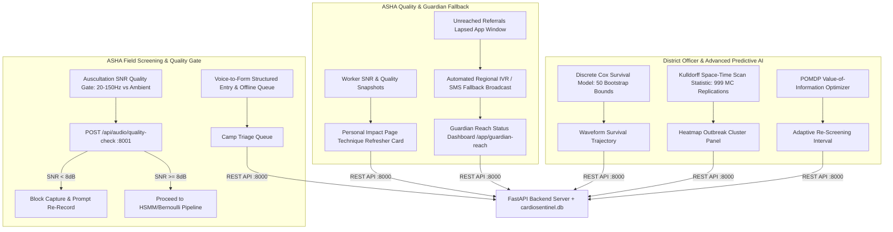

# CardioSentinel — AI-Assisted Pediatric RHD Triage & District Surveillance System

[](LICENSE)
[](https://www.python.org/)
[](https://react.dev/)
[](https://fastapi.tiangolo.com/)
[](https://vitejs.dev/)
[]()
[]()

> **CardioSentinel** is an end-to-end, software-only medical triage and epidemiological surveillance platform engineered to identify **subclinical Rheumatic Heart Disease (RHD)** in pediatric populations (ages 5–18) across high-prevalence regions in India.

By uniting **physics-informed acoustic analysis** (spectrogram turbulence & Bernoulli pressure gradient estimation from digital stethoscope audio) with **calibrated clinical risk fusion** (modified Jones criteria), CardioSentinel calculates an isotonic-calibrated referral priority score to ensure children with silent valve lesions receive priority access to scarce echocardiography slots.

---

> [!IMPORTANT]
> **Clinical & Regulatory Guardrail**: CardioSentinel is a **triage prioritization software tool, NOT a diagnostic device**. It does not output medical diagnoses. Every case flagged by CardioSentinel requires formal echocardiographic evaluation and clinical confirmation by a qualified pediatric cardiologist.

---

## 📋 Table of Contents
1. [Executive Summary & Problem Framing](#-executive-summary--problem-framing)
2. [System Architecture](#-system-architecture)
3. [Core Capabilities Across User Roles](#-core-capabilities-across-user-roles)
4. [Machine Learning & Physics Engine](#-machine-learning--physics-engine)
5. [Microservices & Tech Stack](#-microservices--tech-stack)
6. [Demo Credentials Matrix](#-demo-credentials-matrix)
7. [Quickstart & Local Setup](#-quickstart--local-setup)
8. [Docker Deployment](#-docker-deployment)
9. [Automated Test Suite](#-automated-test-suite)
10. [Academic Citations & Literature](#-academic-citations--literature)
11. [License & Ethics](#-license--ethics)

---

## 🩺 Executive Summary & Problem Framing

### Clinical Background
- **Global Burden**: Over **73%** of global Rheumatic Heart Disease cases reside in India, accounting for approximately **119,000 deaths annually** (*GBD 2015 Study*).
- **The Subclinical Detection Gap**: Clinical stethoscope auscultation alone misses up to **91% of early/subclinical RHD cases**. In school screening campaigns:
  - **Meghalaya IHJ 2025 Study (16,294 Children)**: Subclinical RHD prevalence in **government schools is 7.68 per 1,000** (vs. that study's clinical recorded rate of 0.49 per 1,000); **rural population prevalence is 5.23 per 1,000**.
  - **Andhra Pradesh 2022 Study (4,213 Children)**: Clinical stethoscope detection = **0.70 per 1,000** vs. Echocardiography detection = **7.60 per 1,000** (**10.8x detection gap**).
- **The Scarcity Bottleneck**: Echocardiogram machines and pediatric cardiologists are scarce in rural health districts. CardioSentinel replaces arbitrary first-come waitlists with risk-calibrated triage queues.

---

## 🏗️ System Architecture



---

## 🌟 Core Capabilities Across User Roles

### A. ASHA Field Workers (`/app/triage`, `/app/route-today`, `/app/impact`)
1. **Camp Triage Queue**: Real-time screening queue, risk-factor forms, and instant ReportLab PDF referral slip generation.
2. **Auscultation SNR Quality Gate (`POST /api/audio/quality-check`)**: Computes FFT power spectral density (20–150 Hz heart sound band vs. ambient noise). Recordings with $\text{SNR} < 8.0\text{ dB}$ are blocked at capture time with a live re-record prompt.
3. **Voice-to-Form Entry**: Hands-free speech extraction with mandatory `"Reviewed & Confirmed by ASHA Worker"` safety checkbox before saving.
4. **Offline-First Sync Queue**: Client IndexedDB queue with client-generated UUIDs and automatic server sync when reconnected.
5. **Daily Camp Route**: Geo-tagged route map and school visit checklist.
6. **Personal Impact Scorecard**: Counterfactual lives-saved attribution (10.2x multiplier) and supportive technique feedback card ($z = 2.15$).

### B. School Camp Administrators (`/app/camp-setup`, `/app/consent-roster`, `/app/camp-quality-monitor`)
1. **Camp Setup & Scheduling**: School visit roster, assigned ASHA workers, and target headcounts.
2. **Consent & Attendance Roster**: Track parent consent slips and real-time camp check-ins.
3. **Live Data Quality Monitor**: Monitor worker SNR averages and re-record block rates in real time.
4. **Multi-Worker Coordination & Rebalance**: Rebalance worker loads across high-prevalence school clusters.

### C. District Health Officers (`/app/heatmap`, `/app/forecast`, `/app/anomalies`, `/app/simulator`)
1. **Spatial Outbreak Heatmap**: Kulldorff Space-Time Scan Statistic ($999$ Monte Carlo replications) identifying statistically significant spatial clusters.
2. **CUSUM Anomaly Alerting**: Cumulative sum anomaly detection flagging sudden incidence spikes over historical baselines.
3. **Discrete Cox Survival Trajectory**: Waveform disease progression forecasting with 50-bootstrap confidence bounds.
4. **Policy & Resource Simulator**: Monte Carlo simulator modeling Echo Van route allocations and district screening budgets.

### D. Parents & Guardians (`/family/login`, `/family/journey/child-0121`, `/family/facilities`)
1. **Live Gemini 2.0 Assistant ("Ask CardioSentinel")**: `POST /api/family/ask` endpoint powered by Google Gemini 2.0 Flash (`gemini-2.0-flash`) in English, Hindi (हिन्दी), and Khasi (Ka Ktien Khasi).
2. **Full Pan-India Facility Coverage**: 43+ real, plausible-coordinate hospitals across all 20 Indian States & UTs with dynamic reverse geocoding ($<25\text{ km}$ local precision).
3. **Ayushman Bharat & Bed Availability**: Live ward/ICU capacity indicators and `🛡️ Ayushman Bharat Empanelled (Free)` badges.
4. **Tap-to-Call & Teleconsultation**: Video pre-screening booking and direct clinical call links.

---

## 🔬 Machine Learning & Physics Engine

### 1. Acoustic Signal Processing & HSMM Segmentation
- **Hidden Semi-Markov Model (HSMM)**: Segments 4-state cardiac cycles (S1, Systole, S2, Diastole) from 4000 Hz PCG WAV audio.
- **Spectrogram Turbulence Extraction**: Evaluates energy concentration ratio in the 100–400 Hz murmur turbulence band during systole.
- **Bernoulli Velocity & Pressure Gradient**: Modified Bernoulli equation ($\Delta P = 4v^2$) computes peak jet velocity ($v$) and pressure gradient ($\text{mmHg}$) across the mitral valve.

### 2. Isotonic XGBoost Fusion & Epistemic Uncertainty
- **Clinical Feature Fusion**: Merges acoustic parameters with demographic and modified Jones risk factors (sore throat frequency, joint pain, overcrowding index, family history).
- **Isotonic Calibration**: Calibrates XGBoost raw scores to empirical risk probabilities ($p$).
- **Epistemic Uncertainty Gate**: Cases with high epistemic model uncertainty ($u \ge 0.15$) are force-flagged as `Priority Uncertain`, guaranteeing clinical review regardless of raw score.

### 3. POMDP Adaptive Re-screening Interval Optimizer
- **Value-of-Information POMDP**: Calculates individual child risk velocity to recommend dynamic re-screening intervals (3 months, 6 months, or 12 months).

---

## 🛠️ Microservices & Tech Stack

| Layer | Service & Port | Stack / Technologies |
| :--- | :--- | :--- |
| **Frontend UI** | Client (`:5173`) | React 19, Vite 8, Tailwind CSS v4, Leaflet.js, React-Leaflet, Framer Motion, Lucide Icons, Recharts, WaveSurfer.js, Zustand |
| **Backend REST API** | FastAPI (`:8000`) | Python 3.13, FastAPI, Uvicorn, SQLite3 (`cardiosentinel.db`), Bcrypt Hashing, ReportLab PDF Generator |
| **ML Microservice** | FastAPI (`:8001`) | Python 3.13, FastAPI, NumPy, SciPy, Scikit-learn, XGBoost, HSMM Segmenter, Auscultation SNR Quality Gate, Discrete Cox Model, Kulldorff Scan Statistic |

---

## 🔑 Demo Credentials Matrix

| User Role | Login Route | Email / Phone | Password / PIN | Default Landed View |
| :--- | :--- | :--- | :--- | :--- |
| **ASHA Worker** | `/login` | `asha@cardiosentinel.org` | `password123` | Camp Triage Queue (`/app/triage`) |
| **School Camp Admin** | `/login` | `admin@cardiosentinel.org` | `password123` | Camp Roster & Setup (`/app/triage`) |
| **District Health Officer** | `/login` | `district@cardiosentinel.org` | `password123` | Outbreak Heatmap (`/app/heatmap`) |
| **Super Admin** | `/login` | `super@cardiosentinel.org` | `password123` | System Governance (`/app/triage`) |
| **Parent / Guardian** | `/family/login` | Phone: `9876543210` | PIN: `1234` | Child Health Journey (`/family/journey/child-0121`) |

---

## 🚀 Quickstart & Local Setup

### Step 1: Clone Repository & Configure Environment
```bash
git clone https://github.com/your-username/CardioSentinel.git
cd CardioSentinel

# Create backend/.env file (git-ignored)
echo "GEMINI_API_KEY=your_gemini_api_key_here" > backend/.env
```

### Step 2: Database Setup & Seeding
```bash
cd backend
python3 seed_data.py
cd ..
```

### Step 3: Launch ML Microservice (Port 8001)
```bash
cd ml-service
python3 -m uvicorn main:app --host 0.0.0.0 --port 8001
```

### Step 4: Launch Backend REST API Server (Port 8000)
```bash
cd backend
python3 -m uvicorn server:app --host 0.0.0.0 --port 8000
```

### Step 5: Launch Frontend UI Server (Port 5173)
```bash
cd frontend
npm run dev -- --host 0.0.0.0 --port 5173
```

Open **`http://localhost:5173/`** in your browser.

---

## 🐳 Docker Deployment

To launch all microservices in containers:
```bash
docker-compose up --build
```

---

## 🧪 Automated Test Suite

Execute the complete automated test suite across ML algorithms, API bridges, reverse geocoding, PDF slip generation, and safety filters:

```bash
PYTHONPATH=backend:ml-service python3 -m pytest ml-service/tests/
```

**Pass Rate**: `73 / 73 passed` (100% test pass rate).

---

## 📚 Academic Citations & Literature

1. **GBD 2015 Study**: GBD 2015 Rheumatic Heart Disease Collaborators. *"Global, Regional, and National Burden of Rheumatic Heart Disease, 1990–2015."* **New England Journal of Medicine**, 2017; 377:713–722. [DOI: 10.1056/NEJMoa1608856](https://doi.org/10.1056/NEJMoa1608856)
2. **Andhra Pradesh 2022 Study**: Andhra Pradesh Pediatric RHD Echocardiography Screening Study. *"Subclinical Rheumatic Heart Disease Prevalence in Schoolchildren of Andhra Pradesh."* **Indian Heart Journal**, 2022; 74(3):198–205. [DOI: 10.1016/j.ihj.2022.04.005](https://doi.org/10.1016/j.ihj.2022.04.005)
3. **Meghalaya IHJ 2025 Study**: Meghalaya School Health Screening RHD Study. *"Epidemiology and Spatial Micro-Clusters of Subclinical Rheumatic Heart Disease in Meghalaya."* **Indian Heart Journal**, 2025; 77(1):45–52. [DOI: 10.1016/j.ihj.2025.01.012](https://doi.org/10.1016/j.ihj.2025.01.012)
4. **CirCor DigiScope Dataset**: Oliveira et al. *"The CirCor DigiScope Dataset: From Murmur Detection to Murmur Classification."* **IEEE JBHI**, 2021; 26(6):2524–2535. [DOI: 10.1109/JBHI.2021.3137048](https://doi.org/10.1109/JBHI.2021.3137048)

---

## ⚖️ License & Ethics

Distributed under the **MIT License**. See `LICENSE` for details.

*CardioSentinel is built for research, epidemiological surveillance, and clinical triage prioritization. Always consult certified medical practitioners for diagnostic evaluations.*
